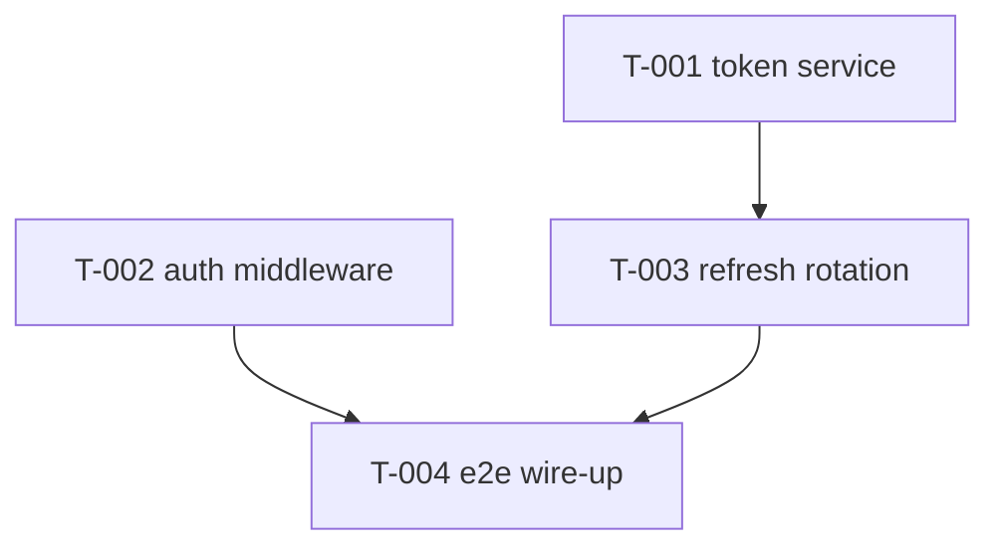

# Break Into Tasks — Station 2 (Tasks) + Gate 2

Convert the design into a set of **TDD tasks**, each a small demoable increment. The
plan-approval gate here is the cheapest, highest-value intervention in the whole flow:
skimming a task checklist for 60 seconds catches high-cost logic defects before a line of
code exists. A 2026 study of ~9,400 agent trajectories found planning-before-editing
correlates strongly with success (ρ≈+0.68) and premature patching correlates even more
strongly with failure (ρ≈−0.78) [arXiv:2604.02547]. This gate forces the well-supported
behavior on every task.

> **A test is "correct" made machine-checkable.** Each task states, as tests, exactly what
> "done" means, so the agent gets a green/red signal at every step instead of guessing.

---

## Procedure

1. **Load the plan** at `docs/plans/<slug>.md` and its acceptance-criteria trace.
2. **Slice into tasks.** Each task must:
   - produce a working, demoable increment,
   - build on the ones before it,
   - carry a test for each business rule and each edge case it owns (not coverage theater —
     a test per rule/edge case is the target).
   - The final task wires everything into an end-to-end run.
3. **Assign IDs and dependencies.** Give each task `T-00N`. Fill `depends_on` with the
   tasks that must be `done` first. The graph **must be acyclic** — verify no cycles.
   **Then check dependency *coverage*, not just legality:** for each task, list the
   functions, modules, or files its body says it *uses*, and confirm every one is produced
   by a task in its `depends_on` (directly or transitively). A task that calls
   `portfolio_return()` must depend on the task that defines it. This catches the two most
   common graph bugs a cycle-check misses:
   - **Under-declared:** the task uses a symbol from a task it doesn't depend on (it'll
     hit a missing import at implementation time).
   - **Over-declared:** the task depends on something it never uses (kills parallelism for
     no reason — a pure-presentation task should not depend on the database layer).
4. **Mark parallel safety.** Set `parallel_safe: false` for any task that touches files
   another task touches; list files in `touches`. This drives the loop's parallel guardrail.
5. **Write the body as a mini Work Order.** Reuse the intake template (business rules,
   acceptance criteria, edge cases, off-limits) and add a **test plan** (test → behavior
   pairs) and a **demo** line.
6. **Ask GitHub vs local at runtime** (see below) and, if GitHub, mirror each task into
   an issue.
7. **Reject-first, then Gate 2.** Try to reject your own first cut — find one missing case.
   Then present to the human and STOP for approval.

---

## Task file format (`docs/tasks/<id>.md`)

Frontmatter = orchestration (machine-read by the loop). Body = the mini Work Order.

```markdown
---
id: T-003
title: <short objective>
depends_on: [T-001, T-002]
status: todo                 # todo | in_progress | blocked | in_review | done
parallel_safe: true          # false if it touches files another task touches
touches: [src/auth/*.ts]     # file globs — used for the parallel overlap check
issue:                       # GitHub mode only: the mirrored issue number (e.g. 42)
---

## Task: [what]

### Business rules
1. [testable rule]

### Acceptance criteria
- [ ] [observable outcome]

### Edge cases
- [the thing that breaks at 2am]

### Off-limits
- [the constraint the agent must not cross]

### Test plan
- [test -> behavior pair]

### Demo
- [what can be shown working after this task]
```

The five `status` values are the loop's state machine: `todo → in_progress →
in_review → done`, with `blocked` when a dependency isn't `done` yet.

---

## Choosing GitHub vs local mode (ask at runtime)

Do not assume. Ask the human once, before emitting tasks:

> "Track these tasks as **GitHub issues** (I'll create issues + a branch per task, and
> deliver via PRs), or **local** (task files under `docs/tasks/`, review + merge locally)?"

- **Local mode:** tasks live only as `docs/tasks/<id>.md`. `deliver.md` does local
  review + merge.
- **GitHub mode:** each task file is also mirrored to an issue —
  - frontmatter (`id`, `depends_on`, `status`, `parallel_safe`) → labels / metadata,
  - the mini Work Order body → the issue body,
  - keep the `docs/tasks/<id>.md` file as the source of truth and sync status both ways.
  - **Create idempotently.** Before creating an issue, check whether one already exists for
    this task (search by the `T-<id>` label or title) and reuse it — creating blind produces
    duplicate issues for the same task.
  - **Record the issue number** back into the task file's `issue:` frontmatter field. This
    is the durable task↔issue mapping that `deliver.md` (to auto-close on merge) and the
    sync step (to reconcile status) both rely on. Also label the issue `T-<id>` as a fallback.

Record the chosen mode in the plan file so `implement-task-loop` and `deliver` know which
path to take.

---

## Dependency graph (emit alongside the tasks)

Produce a small graph so dependencies and parallelism are visible at a glance, and to
prove there are no cycles:



---

## The reject-first habit (do this before Gate 2)

The plan is cheap to skim and *feels* like progress, so people wave it through. Counter it:
**try to reject your first cut.** Find one missing case (a concurrency race, an expiry
boundary, an error path). If you genuinely can't, the plan was good. If you can, you just
caught a high-cost defect for the price of reading a checklist.

If you don't know the domain well enough to reject a bad plan confidently, say so and ask
the human to pair on approval rather than rubber-stamping solo.

---

## Gate 2 — the hard stop

Present the task list and stop:

> "Task plan for `<slug>`: T-001…T-00N, dependency graph attached, mode = <github|local>.
> I already rejected my first cut and added `<the missing case>`. **Approve, or tell me
> what's missing?** I won't implement until you approve."

On approval, set each task's `status: todo` (ready) and hand off to the loop.

---

## Self-check (dry-run validation)

- [ ] Every task file has valid frontmatter (id, depends_on, status, parallel_safe, touches).
- [ ] The `depends_on` graph is acyclic (no cycles) and every referenced id exists.
- [ ] Dependency coverage checked: each task's declared deps cover every symbol/module its
      body uses (no under-declared), and it depends on nothing it doesn't use (no over-declared).
- [ ] Each body is a mini Work Order with a test plan and a demo line.
- [ ] Each business rule / edge case from the plan maps to a test in some task.
- [ ] The GitHub-vs-local prompt was asked and the choice recorded in the plan.
- [ ] (GitHub mode) issues carry the same fields as the task files.
- [ ] Reject-first was performed and the added case is visible; then it halted at Gate 2.

---

## Handoff

On approval, proceed to **`implement-task-loop`** (Station 2 + 3) to execute
the ready tasks.
