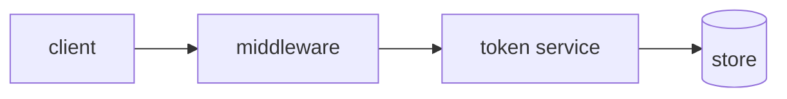
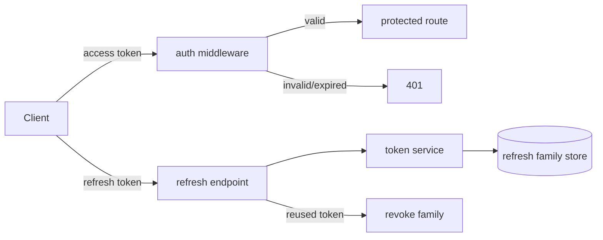

# Create Plan — Station 2 (Design)

The approved Work Order says *what* correct means. This skill decides *how*, grounded in
the actual codebase — before anything gets broken into tasks. Reading and planning before
editing is the strongest predictor of task success; premature patching is the strongest
predictor of failure. This station forces the planning.

> **Guard: is this even a line part?** The line is for well-defined parts, not R&D.
> If the spec is really "I don't know what I want yet," novel architecture, or deep
> unknown domain logic, do **not** force it through spec→plan→gate. Route it to
> **conductor mode** (defined below), and only put the resulting well-defined
> implementation back on the line. Make this call explicitly in the plan.

### What "conductor mode" means

Conductor mode is the explicit fallback for work that isn't ready for the line — it is
**not** a separate skill, it's a way of working:

- **You and the agent iterate turn-by-turn in real time** — propose, try, inspect,
  correct — instead of writing a full spec and delegating a batch.
- **The always-on rules still apply** (plan before edit, tests where they fit, never
  bypass or weaken gates). What's relaxed is only the spec→plan→tasks *ceremony*.
- **How to enter:** in the plan, list the exploratory item under "Routed to conductor
  mode" and stop planning it. Then work it live with the human.
- **How to exit:** once the shape is known and stable, write it up as a spec section
  (`intake-requirement`) and send *that* down the normal line. Conductor mode is the
  on-ramp, not a parallel track.

---

## Procedure

1. **Load the spec map + the approved section(s).** Read `docs/specs/<slug>/overview.md`
   for intent and cross-cutting constraints, then the section spec(s) you're designing.
   Confirm each target section's `Status: approved`. If a section isn't approved, go back
   to `intake-requirement.md` — do not design against a draft. You may design one approved
   section at a time, or the whole map once every section is approved.
2. **Research the code.** Read the modules the change will touch. Identify existing
   patterns, conventions, libraries, and constraints. Prefer reusing what's there over
   introducing new dependencies or patterns.
3. **Make the R&D-vs-line decision.** For each part of the work, classify: *line part*
   (well-defined, goes on the pipeline) or *exploratory* (route to conductor mode first).
   Record it. If the whole thing is exploratory, say so and stop — don't manufacture a
   plan for something that isn't ready.
4. **Design the solution.** Describe the approach, the components involved, data flow,
   and the key decisions. Use a mermaid diagram where a picture beats prose.
5. **Map design → acceptance criteria 1:1.** Every acceptance criterion in the spec must
   be satisfied by something in the plan. Build a table that traces each criterion to the
   design element that delivers it. A criterion with no home means the design is incomplete.
6. **Call out risks and judgment calls** — the security boundaries, data-handling
   decisions, and choices the spec couldn't fully pin down. These become Inspection focus later.
7. **Write it to `docs/plans/<slug>.md`** using the template. This feeds directly into
   `break-into-tasks.md`.

---

## Plan template (`docs/plans/<slug>.md`)

```markdown
# Plan: <title>

- Slug: <slug>
- Spec: docs/specs/<slug>/overview.md (+ section(s): <section>.md)
- Status: draft

## Line vs R&D decision
- On the line (well-defined): <list>
- Routed to conductor mode (exploratory): <list, or "none">

## Approach
Prose description of the how. What changes, where, and why this shape.

## Design


## Components touched
- `<path>` — <what changes>

## Acceptance-criteria trace (1:1 with the spec)
| Acceptance criterion | Delivered by |
|---|---|
| <criterion 1> | <design element> |
| <criterion 2> | <design element> |

## Risks & judgment calls
- <security boundary / data handling / decision the spec left open>

## Test strategy notes
- Which paths are critical enough to warrant the optional guards (held-out tests /
  mutation testing) — see `implement-task-loop.md` Step 4; skip them if the stack/harness
  doesn't support them rather than faking coverage.
```

---

## Worked example (from the jwt-auth spec)

```markdown
# Plan: JWT authentication for the API

- Slug: jwt-auth
- Spec: docs/specs/jwt-auth/overview.md (+ sections: refresh-rotation.md, …)
- Status: draft

## Line vs R&D decision
- On the line: token issue/verify, refresh rotation, 401 middleware.
- Routed to conductor mode: none (well-defined).

## Approach
Add a token service that signs short-lived access tokens and single-use refresh tokens.
Auth middleware verifies access tokens and returns 401 on any failure. Refresh endpoint
rotates the refresh token and detects reuse via a per-family counter.

## Design


## Components touched
- `src/auth/tokenService.*` — sign/verify, rotation, family tracking.
- `src/auth/middleware.*` — verify access token, 401 on failure.
- `src/routes/refresh.*` — refresh + reuse detection.

## Acceptance-criteria trace (1:1 with the spec)
| Acceptance criterion | Delivered by |
|---|---|
| Protected route w/o token → 401 (never 500) | auth middleware |
| Valid access token grants access for 15 min | token service (exp) + middleware |
| Refresh returns new pair; old refresh invalid | refresh endpoint + rotation |
| Reused refresh token revokes family | family store + reuse detection |

## Risks & judgment calls
- Refresh-token storage model and key management — human judgment at Inspection.
- Concurrent refresh race — must be covered by an edge-case test.

## Test strategy notes
- Reuse detection is the critical path — worth the optional held-out test (if a separate
  reviewer writes the code) or a mutation check. Otherwise, make "harness vs intent?" an
  explicit Inspection question.
```

---

## Self-check (dry-run validation)

- [ ] Plan exists at `docs/plans/<slug>.md` and links back to the approved spec.
- [ ] The acceptance-criteria trace table covers **every** criterion 1:1 (none orphaned).
- [ ] The line-vs-R&D decision is explicit; any exploratory item is flagged off-line.
- [ ] Risks / judgment calls are named for Inspection.
- [ ] The design reuses existing patterns where possible (no gratuitous new deps).

---

## Handoff

Proceed to **`break-into-tasks`** (Station 2 — tasks + Gate 2) to convert this
plan into TDD tasks.
