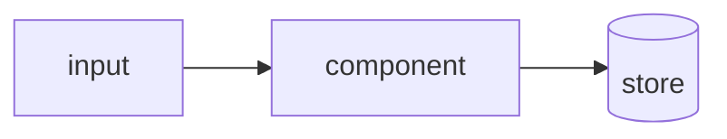

# Plan: <title>

- Slug: <slug>
- Spec: docs/specs/<slug>/overview.md
- Sections covered: <section-slugs designed in this plan so far>
- Status: draft
- Mode: <github | local>

## Line vs R&D decision
- On the line (well-defined): <list>
- Routed to conductor mode (exploratory): <list, or "none">

## Approach
Prose description of the how. What changes, where, and why this shape.

## Design

## Components touched
- `<path>` — <what changes>

## Acceptance-criteria trace (1:1 with the spec)
| Acceptance criterion | Delivered by |
|---|---|
| <criterion 1> | <design element> |

## Risks & judgment calls
- <security boundary / data handling / decision the spec left open>

## Test strategy notes
- Which paths are critical enough for the optional guards (held-out tests / mutation);
  otherwise make "harness vs intent?" an explicit Inspection question.
